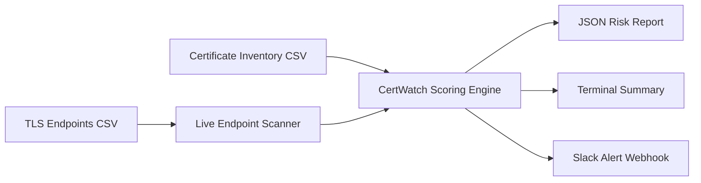

# CertWatch

CertWatch is an MVP for detecting certificate outage risk before incidents happen.
It models a common PKI operations challenge: shrinking certificate lifetimes make
manual renewal workflows unreliable at scale.

**Tagline:** Proactive certificate risk intelligence for zero-downtime trust.

## What it does

- Reads certificate metadata from CSV.
- Optionally scans live TLS endpoints from a separate CSV.
- Scores each certificate with explainable risk factors:
  - days to expiry
  - manual vs automated renewal
  - environment (prod/stage/dev)
  - service criticality
- Treats endpoint scan failures as high risk.
- Prints a terminal table and writes a JSON report for observability pipelines.
- Optionally posts a top-risk summary to Slack via Incoming Webhook.

## Why this is relevant

- Simulates the transition from long-lived cert assumptions to short-lifetime
  operational reality.
- Highlights where automation gaps create immediate production risk.
- Provides a foundation for dashboarding and alerting.

## Architecture



## Quick demo flow

1. Run CertWatch with inventory + endpoint scan.
2. Show top risk entries and explain why each scored high.
3. Send top risks to Slack channel.
4. Explain production next step: schedule daily run + ownership routing.

## Run (inventory only)

```bash
cd "CertWatch"
python3 risk_scorer.py --input sample_certs.csv --output-json report.json --as-of 2026-06-18
```

## Run with live endpoint scans

```bash
cd "CertWatch"
python3 risk_scorer.py \
  --input sample_certs.csv \
  --endpoints-csv sample_endpoints.csv \
  --output-json report_with_endpoints.json
```

## Run with Slack alert

```bash
cd "CertWatch"
python3 risk_scorer.py \
  --input sample_certs.csv \
  --endpoints-csv sample_endpoints.csv \
  --output-json report_with_endpoints.json \
  --slack-webhook-url "https://hooks.slack.com/services/XXX/YYY/ZZZ" \
  --slack-top-n 5
```

## Run daily in GitHub Actions

The repo includes `.github/workflows/daily-scan.yml` which:

- runs once per day (UTC)
- executes CertWatch against your CSVs
- uploads the JSON report as a workflow artifact
- optionally posts Slack alerts when `SLACK_WEBHOOK_URL` is configured

Set repository secret:

- `SLACK_WEBHOOK_URL` (optional but recommended)

## CSV schema

Required columns:

- `service_name`
- `owner_team`
- `environment` (`prod`, `stage`, `dev`)
- `cert_id`
- `expires_on` (`YYYY-MM-DD`)
- `renewal_automated` (`true`/`false`)
- `criticality` (`high`, `medium`, `low`)

## Endpoint scan CSV schema

Required columns:

- `service_name`
- `owner_team`
- `environment` (`prod`, `stage`, `dev`)
- `endpoint` (hostname only, e.g. `api.github.com`)
- `port` (e.g. `443`)
- `renewal_automated` (`true`/`false`)
- `criticality` (`high`, `medium`, `low`)

## Next extensions

- Pull cert data from Kubernetes secrets and cert-manager APIs.
- Add SLO-aware risk multipliers.
- Add Slack slash commands (`/cert-risk`) and ticket creation actions.
- Emit PagerDuty alerts for critical scores.
- Track policy compliance for 200-day and future 47-day windows.
- Add issue/ticket auto-creation for `critical` risks.

## Slack setup guide

Use `docs/slack-setup.md` for a step-by-step setup and test checklist.

## Demo presentation guide

- Scripted talk track: `docs/demo-presentation-script.md`
- One-command demo runner: `scripts/demo_run.sh`
